# steps for setting up the CSSS jenkins

## useful links

1. https://wiki.jenkins.io/display/JENKINS/Jenkins+behind+an+NGinX+reverse+proxy
1. https://github.com/hughperkins/howto-jenkins-ssl/blob/master/letsencrypt.md
1. https://github.com/jenkinsci/docker/blob/master/README.md

## Create job to build wall_e
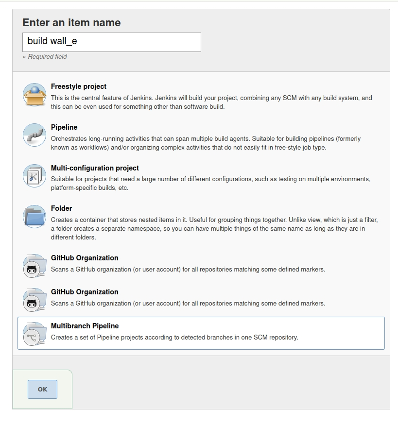

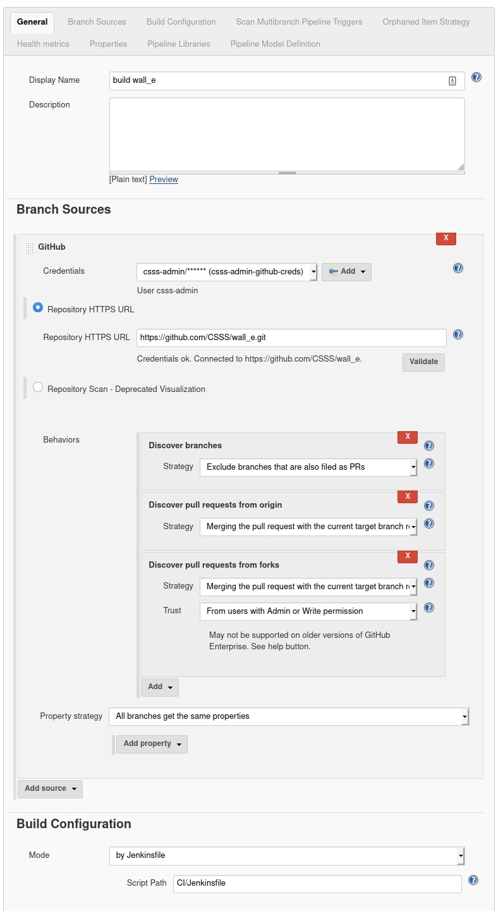

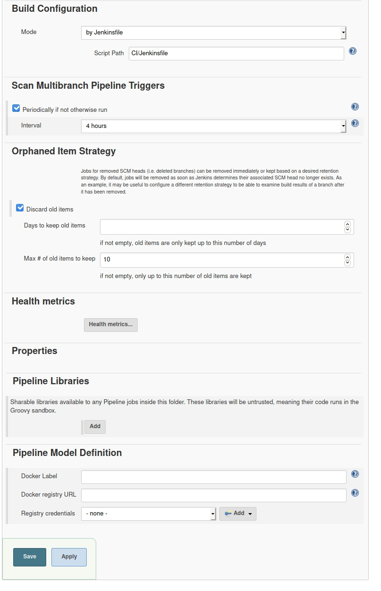

## Create jobs to remove outdates branch and PRs based discord channels and containers

### Change security Settings on Jenkins to allow Github anonymous webhooks

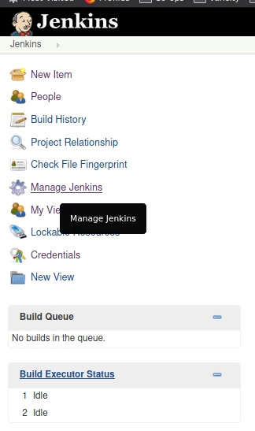

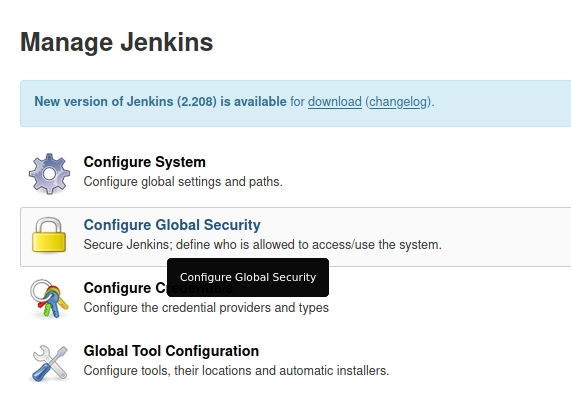

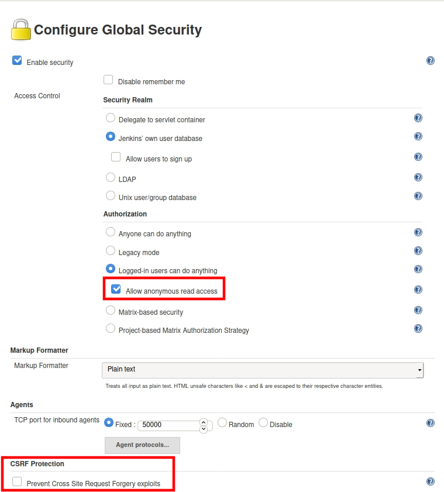

### Jenkins Jobs to create

#### wall-e-clean-branch

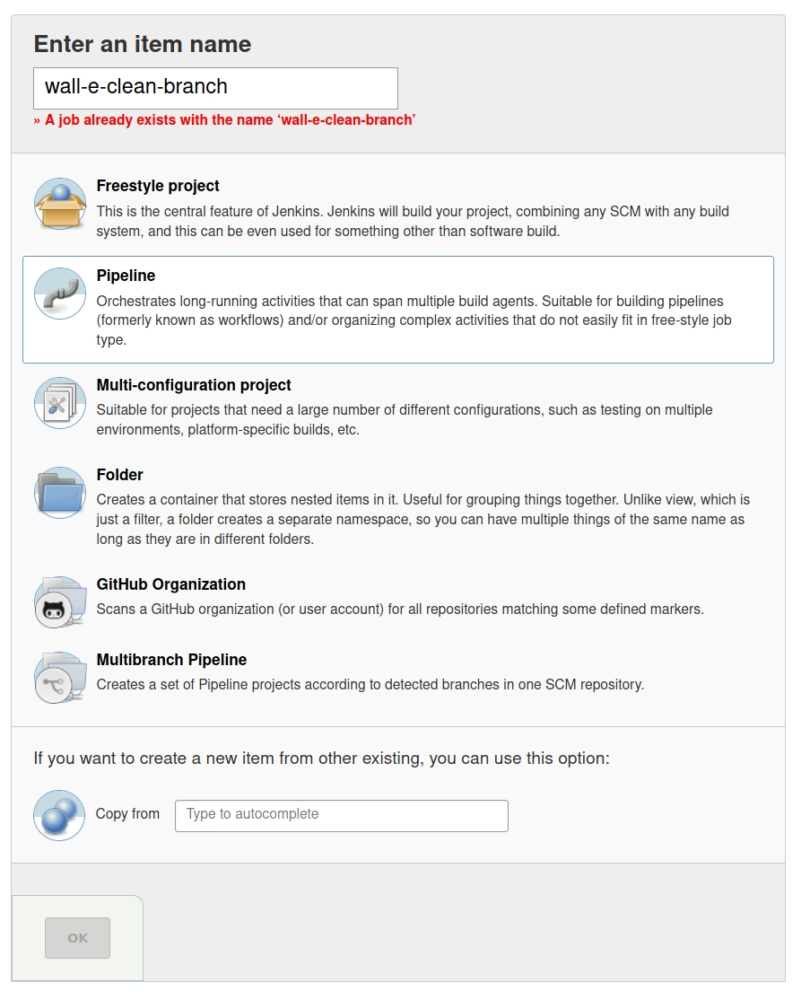

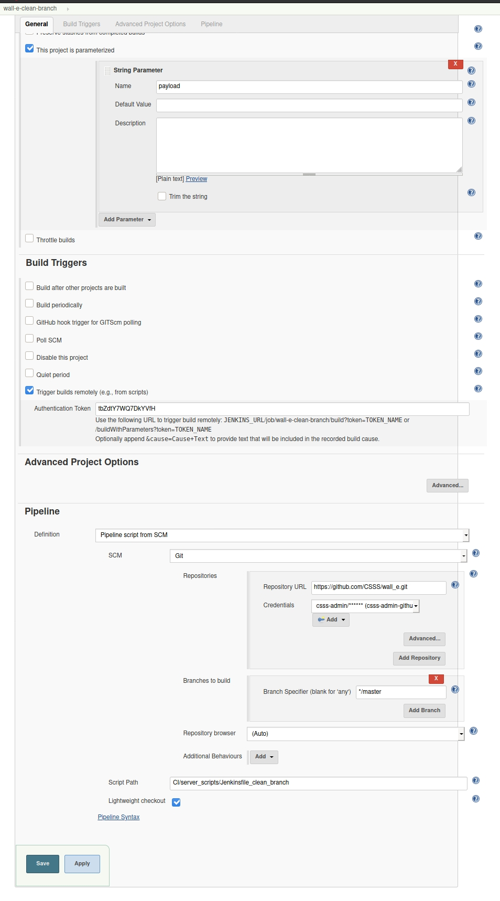

#### wall-e-clean-pr

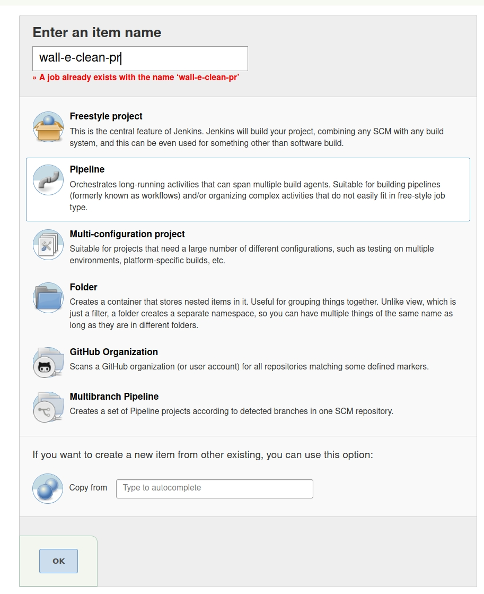

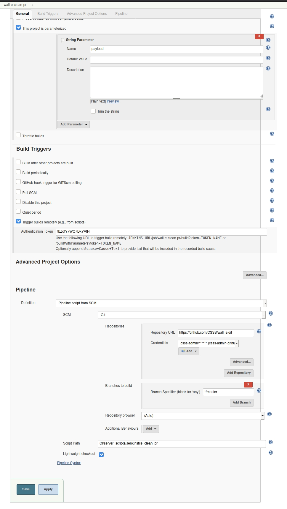

### Github webhook to create

#### wall-e-clean-branch

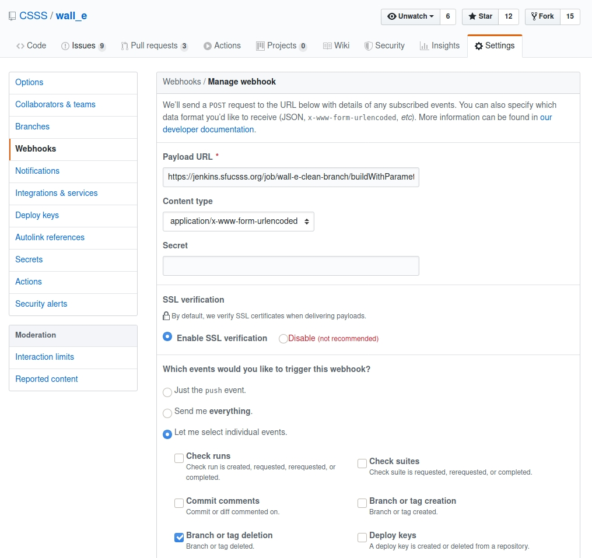

Payload URL: `https://jenkins.sfucsss.org/job/wall-e-clean-branch/buildWithParameters?token=<token>`

#### wall-e-clean-pr

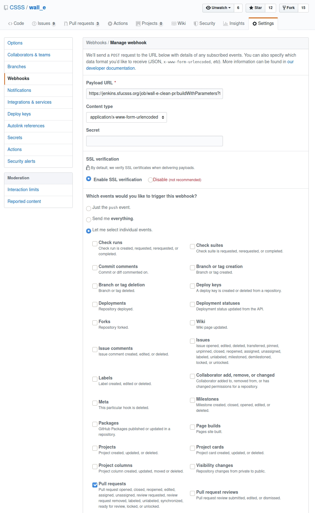

Payload URL: `https://jenkins.sfucsss.org/job/wall-e-clean-pr/buildWithParameters?token=<token>`

### disable csrf

https://unix.stackexchange.com/a/582764/328370
